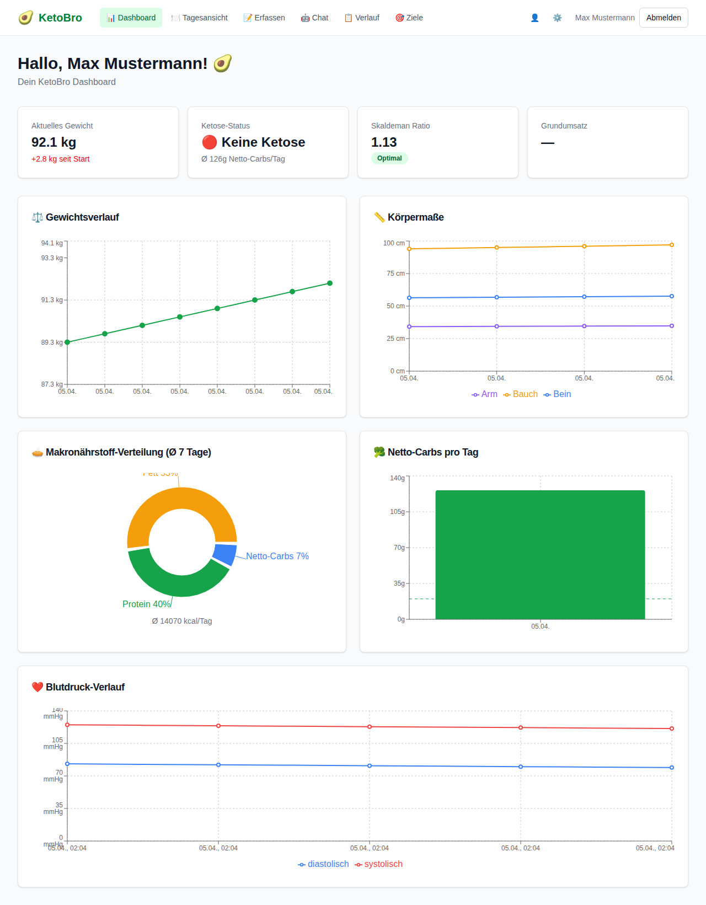
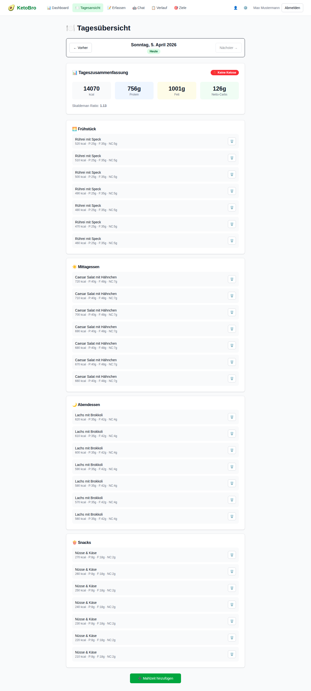
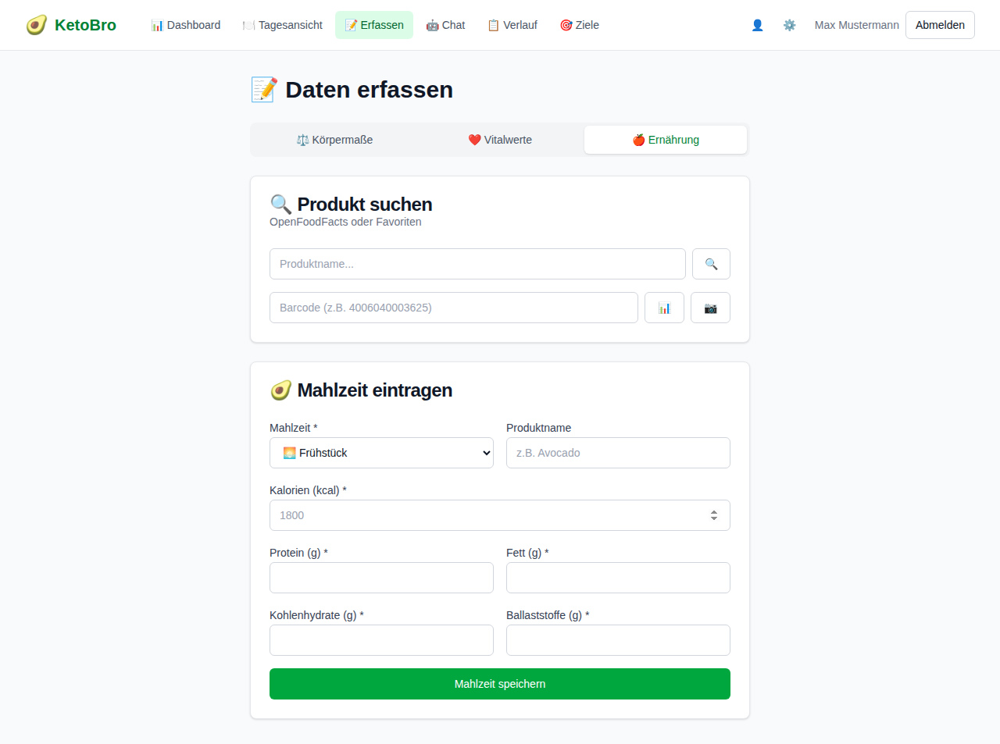
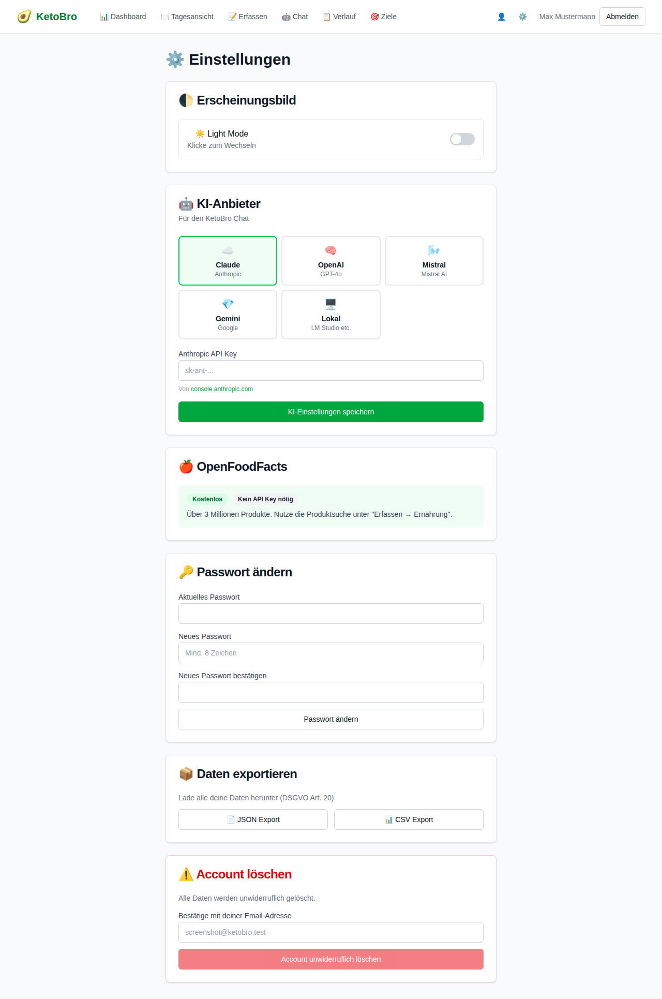
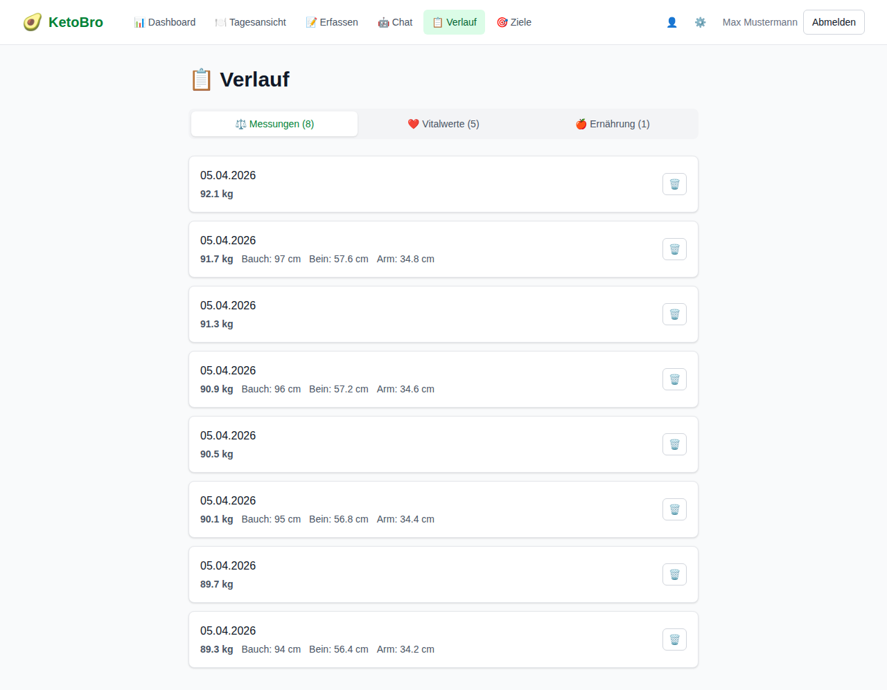

# 🥑 KetoBro — KI-gestützter Keto-Ernährungsassistent

KetoBro ist eine Webanwendung, die Menschen auf ihrem ketogenen Ernährungsweg begleitet. Mit KI-Integration, umfassendem Tracking, OpenFoodFacts-Produktsuche und personalisierten Berechnungen hilft KetoBro, die Keto-Ziele zu erreichen.

## ⚠️ Hinweis / Haftungsausschluss

> Dieses Projekt wurde mit KI-Unterstützung entwickelt ("Vibe Coding") und verwendet Open-Source-Abhängigkeiten, die **nicht unabhängig geprüft** wurden. Die Software wird unter der MIT-Lizenz bereitgestellt, ohne jegliche Gewährleistung.

**Wichtig:**

- **KetoBro ersetzt keine ärztliche Beratung oder Ernährungsberatung.** Alle Informationen, Berechnungen und KI-Antworten dienen ausschließlich zu Informationszwecken und stellen keine medizinische Empfehlung dar.
- **Konsultiere vor jeder Ernährungsumstellung deinen Arzt**, insbesondere bei Vorerkrankungen (Diabetes, Nieren-/Lebererkrankungen, Essstörungen, Schwangerschaft etc.).
- Die ketogene Ernährung ist nicht für jeden geeignet. Kinder, Schwangere und Menschen mit bestimmten Stoffwechselerkrankungen sollten eine ketogene Diät **nur unter ärztlicher Aufsicht** durchführen.
- **KI-generierte Antworten können fehlerhaft sein.** Der KI-Assistent gibt allgemeine Informationen, keine medizinischen Diagnosen. Überprüfe wichtige Gesundheitsentscheidungen immer mit einem Fachmann.
- Nährwertangaben aus OpenFoodFacts sind Community-gepflegte Daten und können unvollständig oder fehlerhaft sein.
- Berechnungen (BMR, TDEE, Ketose-Status, Skaldeman Ratio) basieren auf allgemeinen Formeln und können individuell abweichen.
- Dies ist ein **persönliches Hobby-Projekt, keine zertifizierte Gesundheitsanwendung**.

**Kurz gesagt:** Nutze KetoBro als Hilfsmittel und Orientierung — nicht als alleinige Grundlage für Gesundheitsentscheidungen. Im Zweifel immer einen Arzt fragen.

## 📸 Screenshots

| Dashboard | Tagesansicht |
|:---:|:---:|
|  |  |

| Erfassen & Produktsuche | Einstellungen |
|:---:|:---:|
|  |  |

| Verlauf |
|:---:|
|  |

## ✨ Features

### 📊 Dashboard
- Gewichtsverlauf (Liniendiagramm)
- Körpermaße-Entwicklung (Bauch, Bein, Arm)
- Makronährstoff-Verteilung (Kreisdiagramm)
- Netto-Carbs pro Tag (Balkendiagramm)
- Blutdruck-Verlauf
- Ketose-Status & Skaldeman Ratio
- Quick-Stats mit Ziel-Fortschritt

### 🍽️ Tagesansicht
- Alle Mahlzeiten des Tages im Überblick
- Gruppiert nach Frühstück / Mittag / Abend / Snacks
- Laufende Tagessummen (Kalorien, Protein, Fett, Netto-Carbs)
- Fortschrittsbalken bei gesetzten Zielen
- Produktbilder aus OpenFoodFacts
- Navigation zwischen Tagen

### 📝 Daten erfassen
- **Körpermaße:** Gewicht, Bauch-, Bein-, Armumfang
- **Vitalwerte:** Blutdruck, Blutzucker, Ketone (Blut & Urin)
- **Ernährung:** Manuelle Eingabe oder OpenFoodFacts-Suche
- **Mahlzeiten:** Mehrere Einträge pro Tag (automatische Tageszeit-Erkennung)

### 🔍 OpenFoodFacts Integration
KetoBro nutzt die großartige [Open Food Facts](https://world.openfoodfacts.org/) Datenbank — ein freies, offenes Gemeinschaftsprojekt mit über 3 Millionen Lebensmitteln weltweit.

> 💚 **Open Food Facts unterstützen:** Open Food Facts ist ein gemeinnütziges Projekt, das von Freiwilligen getragen wird und auf Spenden angewiesen ist. Wenn dir KetoBro gefällt und du das Projekt dahinter unterstützen möchtest: [Hier spenden](https://donorbox.org/your-donation-to-open-food-facts)

- Produktsuche nach Name (Search-a-licious Engine)
- Barcode-Lookup
- 📷 Kamera-Barcode-Scanner (Mobilgerät)
- Nährwerte pro 100g mit anpassbarer Portionsgröße
- Nutri-Score Anzeige
- Favoriten speichern

### 🤖 KI-Assistent „KetoBro"
- Personalisierter Chat mit Zugriff auf alle User-Metriken
- 6 Anbieter: Claude, OpenAI, Mistral, Gemini, DeepSeek, lokales LLM
- Keto-Wissen, Fortschrittsanalyse, Tipps
- Rate Limiting (50 Nachrichten/Stunde)

### 🎯 Ziele & Tracking
- Zielgewicht, Kalorienziel, Max Netto-Carbs, Protein-Ziel
- TDEE-basierte Kalorienberechnung im Onboarding
- Fortschrittsbalken in der Tagesansicht
- Wochenbericht-API

### 📋 Verlauf
- Historie aller Messungen, Vitalwerte, Ernährungstage
- Einzelne Einträge löschen
- Ernährungstage im Detail anzeigen

### ⚙️ Einstellungen
- KI-Anbieter wählen + API Key hinterlegen
- Dark Mode 🌙
- Passwort ändern
- Daten exportieren (JSON/CSV — DSGVO Art. 20)
- Account löschen

### 🔐 Sicherheit
- Email/Passwort Auth (NextAuth.js, bcrypt)
- API Key Verschlüsselung (AES-256-GCM)
- Rate Limiting
- Onboarding nach Registrierung

## 🛠️ Tech Stack

| Bereich | Technologie |
|---------|------------|
| Frontend & Backend | Next.js 16 (App Router, TypeScript) |
| Datenbank | PostgreSQL 16 |
| ORM | Prisma 6 |
| KI | Anthropic Claude, OpenAI, Mistral, Google Gemini, DeepSeek, lokale LLMs |
| Auth | NextAuth.js (Credentials) |
| UI | Tailwind CSS, shadcn/ui-Style, Dark Mode |
| Charts | Recharts |
| Produktsuche | OpenFoodFacts (Search-a-licious) |
| Barcode-Scanner | html5-qrcode |
| Deployment | Docker, Docker Compose, Caddy |

## 🚀 Schnellstart

### Voraussetzungen
- Docker & Docker Compose

### 1. Repository klonen
```bash
git clone https://github.com/ichabot/KetoBro.git
cd KetoBro
```

### 2. Environment konfigurieren
```bash
cp .env.example .env.production
```

Bearbeite `.env.production`:
```env
POSTGRES_PASSWORD=<sicheres Passwort>
NEXTAUTH_SECRET=<openssl rand -base64 32>
NEXTAUTH_URL=https://deine-domain.de
```

> **Hinweis:** API Keys für KI-Anbieter werden pro User in der App unter ⚙️ Einstellungen hinterlegt — nicht in der .env Datei.

### 3. Starten
```bash
docker compose --env-file .env.production up -d --build
```

Die App läuft auf Port 3000. Für HTTPS empfehlen wir Caddy als Reverse Proxy:

```
# /etc/caddy/Caddyfile
deine-domain.de {
    reverse_proxy localhost:3000
}
```

### 4. Registrieren & Onboarding
- Öffne die App im Browser
- Registriere dich mit Email & Passwort
- Durchlaufe das Onboarding (Profil, Körperdaten, Ziele)
- Hinterlege deinen KI-API-Key unter ⚙️ Einstellungen

## 📁 Projektstruktur

```
KetoBro/
├── src/
│   ├── app/                    # Next.js App Router
│   │   ├── api/                # 25+ API Routes
│   │   ├── chat/               # KetoBro KI-Chat
│   │   ├── dashboard/          # Dashboard mit Charts
│   │   ├── goals/              # Ziele setzen
│   │   ├── history/            # Verlauf / Historie
│   │   ├── login/              # Login
│   │   ├── nutrition/          # Tagesansicht
│   │   ├── onboarding/         # Onboarding Wizard
│   │   ├── profile/            # Profil
│   │   ├── register/           # Registrierung
│   │   ├── settings/           # Einstellungen
│   │   └── track/              # Daten erfassen
│   ├── components/             # React Komponenten
│   │   ├── barcode-scanner.tsx  # Kamera Barcode-Scanner
│   │   ├── dashboard/          # Chart-Komponenten
│   │   ├── navigation.tsx      # Hauptnavigation
│   │   └── ui/                 # UI Primitives
│   └── lib/                    # Utilities
│       ├── auth.ts             # NextAuth Config
│       ├── calculations.ts     # Keto-Berechnungen
│       ├── claude.ts           # Multi-Provider LLM Integration
│       ├── encryption.ts       # AES-256-GCM Verschlüsselung
│       ├── prisma.ts           # Prisma Client
│       ├── rate-limit.ts       # Chat Rate Limiting
│       └── utils.ts            # Helpers
├── prisma/
│   └── schema.prisma           # Datenbankschema
├── scripts/                    # Deployment & Wartung
├── Dockerfile
├── docker-compose.yml
└── .env.example
```

## 🧮 Keto-Berechnungen

| Berechnung | Formel |
|-----------|--------|
| Netto-Carbs | Kohlenhydrate − Ballaststoffe (Europa-Standard) |
| Skaldeman Ratio | Fett(g) ÷ (Protein(g) + Netto-Carbs(g)) — optimal: 1.0–2.0 |
| BMR | Mifflin-St Jeor: 10×Gewicht + 6.25×Größe − 5×Alter ± Geschlecht |
| TDEE | BMR × Aktivitätsfaktor (1.2 bis 1.9) |
| Ketose-Status | ≤20g 🟢 Tiefe Ketose · ≤30g 🟡 Ketose · ≤50g 🟠 Grenzbereich · >50g 🔴 Keine |

## 🔧 Scripts

```bash
./scripts/backup-db.sh              # Datenbank-Backup (gzip, 30 Tage Retention)
./scripts/restore-db.sh <file>      # Datenbank wiederherstellen
./scripts/deploy.sh                 # Git Pull + Docker Rebuild
./scripts/health-check.sh           # System Health Check
```

## 🥑 Allgemeine Hinweise zur ketogenen Ernährung

Die folgenden Informationen dienen nur der Orientierung und ersetzen keine fachärztliche Beratung:

- **Makronährstoff-Verhältnis:** Typisch sind 70–75% Fett, 20–25% Protein, 5–10% Kohlenhydrate
- **Netto-Kohlenhydrate:** In Europa rechnet man Kohlenhydrate minus Ballaststoffe. Ziel: unter 20–50g/Tag
- **Einstiegsphase:** Die ersten 1–2 Wochen können mit der „Keto-Grippe" einhergehen (Müdigkeit, Kopfschmerzen). Ausreichend Wasser und Elektrolyte (Natrium, Kalium, Magnesium) sind wichtig
- **Blutketone:** Ab 0,5 mmol/L gilt man als in Ketose, optimal sind 1,5–3,0 mmol/L
- **Nicht geeignet für:** Schwangere/Stillende (ohne ärztliche Begleitung), Kinder, Menschen mit Typ-1-Diabetes, Leber-/Nierenerkrankungen, Essstörungen
- **Regelmäßige Kontrolle:** Blutwerte (besonders Cholesterin, Leberwerte) regelmäßig vom Arzt prüfen lassen

## ⚠️ Nochmal in aller Deutlichkeit

**KetoBro ist ein Hobby-Projekt und keine medizinische Anwendung.** Die App, ihre Berechnungen und die KI-Antworten ersetzen keine ärztliche Beratung, keine Ernährungsberatung und keine medizinische Diagnose. Nutzung auf eigene Verantwortung. Bei gesundheitlichen Fragen oder Beschwerden immer einen Arzt aufsuchen.

## 📄 Lizenz

MIT License — siehe [LICENSE](LICENSE)

---

**Made with 🥑 and ❤️**
